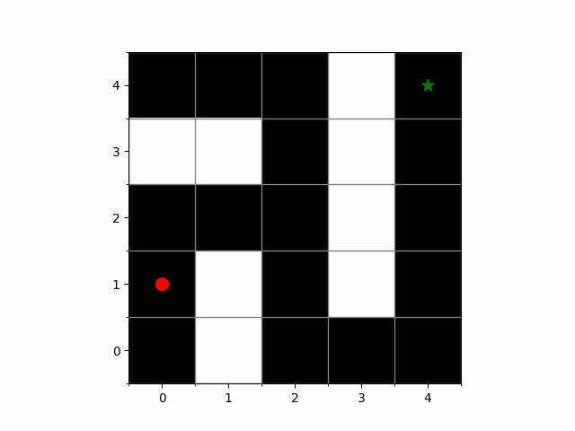

# Reinforcement Learning with Q-Learning: Maze Navigation



## Overview

This project demonstrates **Reinforcement Learning** using the **Q-learning** algorithm to navigate a maze environment. The agent starts from the top-left corner of the maze and aims to reach the goal at the bottom-right corner while avoiding obstacles (walls). The environment and agent are implemented using Python and `gym`. The agent learns to navigate the maze by taking actions, receiving rewards or penalties, and updating its **Q-table** based on experiences.

### Key Concepts:

1. **Reinforcement Learning (RL)**: 
   - RL is a type of machine learning where an agent learns by interacting with an environment. The agent receives feedback in the form of rewards and adjusts its behavior to maximize the cumulative reward over time.
   
2. **Q-Learning**:
   - Q-learning is a model-free RL algorithm that learns the value of actions in different states, updating the **Q-table** using the Bellman equation. It balances **exploration** (trying new actions) and **exploitation** (selecting the best-known actions).

3. **Q-Table**:
   - A table that stores the expected rewards (Q-values) for each state-action pair. It is used by the agent to choose the best action based on the current state.

4. **Maze Environment**:
   - The agent is placed in a 2D grid representing the maze. Some cells are passable, and some are walls. The goal is to reach the bottom-right corner while avoiding walls.

## Environment Description

- **State Space**: The maze is represented as a grid. The agent's position on the grid defines the state. There are `(rows * columns)` possible states.
- **Action Space**: The agent can take four actions: Up, Down, Left, and Right.
- **Rewards**:
  - `+1` for reaching the goal.
  - `+0.1` for valid moves (moving towards the goal).
  - `-1` for hitting a wall or moving out of bounds.

### Files:

1. **`maze_env.py`**:
   - Contains the definition of the maze environment using the `gym.Env` class.
   - Defines the maze, initializes the agent's position, and provides visualization using `matplotlib`.
   - Includes methods for taking actions, resetting the environment, and rendering the agent's movements.

2. **`training_agent.py`**:
   - Implements the Q-learning algorithm.
   - The agent interacts with the environment, learns from rewards, and updates the Q-table.
   - Saves the training data (Q-table history and iterations per episode) for further analysis.

3. **`run.py`**:
   - Uses the trained Q-table to run the agent in the maze.
   - The agent exploits the learned Q-values to reach the goal efficiently without exploration.

4. **`plot_statistics.py`**:
   - Visualizes the training performance by plotting the number of iterations per episode.
   - Uses a moving average to smooth the results and illustrate learning trends over time.

## Training Process

### Q-Learning Parameters:
- **Alpha (α)**: Learning rate, controls how much new information overrides old information (`α = 0.1`).
- **Gamma (γ)**: Discount factor, controls how much future rewards are considered (`γ = 0.9`).
- **Epsilon (ε)**: Exploration rate, controls the balance between exploration and exploitation (`ε = 0.5`).

The agent learns through repeated episodes. In each episode:
- The agent starts from the top-left corner.
- It takes actions, receives rewards, and updates its Q-table based on the **Bellman equation**:
  ```
  Q(state, action) = Q(state, action) + α * [reward + γ * max(Q(next_state, all_actions)) - Q(state, action)]
  ```
- Training continues for `1000` episodes, and the Q-table is updated after each episode.

### Convergence
The agent converges to an optimal policy, meaning it learns the most efficient path to the goal. The number of iterations (steps) required to reach the goal decreases significantly as training progresses, with a steep descent typically occurring around episode 300.

## Results Visualization

1. **Iterations per Episode Plot**:
   - The plot shows the number of iterations the agent took to reach the goal in each episode.
   - A steep descent around episode 300 indicates that the agent has learned an efficient path to the goal.
   - The moving average (red line) smooths out fluctuations, making it easier to observe overall trends.

   

2. **Q-table**:
   - The Q-table is saved after every episode, showing the agent’s learned values for each state-action pair.

## How to Run

1. Clone the repository:
   ```bash
   git clone https://github.com/your-repo/q-learning-maze.git
   cd q-learning-maze
   ```

2. Install dependencies:
   ```bash
   pip install gym matplotlib numpy
   ```

3. Train the agent:
   ```bash
   python training_agent.py
   ```

4. Run the trained agent:
   ```bash
   python run.py
   ```

5. Plot training statistics:
   ```bash
   python plot_statistics.py
   ```

## Insights

- **Exploration vs. Exploitation**: The ε-greedy policy ensures that the agent explores different actions in the beginning. Over time, it exploits the learned knowledge to navigate the maze efficiently.
- **Learning Stability**: The steep decrease in iterations around episode 300 shows that the agent transitions from random exploration to optimized movement.
- **Q-Learning Application**: This project demonstrates how Q-learning can solve grid-based pathfinding problems. The principles can be extended to more complex environments.

## Future Improvements

- **Dynamic Mazes**: Modify the maze layout between episodes to make the environment more challenging.
- **Decreasing Epsilon**: Gradually decrease the exploration rate (`ε`) to favor exploitation as training progresses.
- **Deep Q-Learning (DQN)**: Implement a neural network-based approach to handle larger and more complex mazes.
